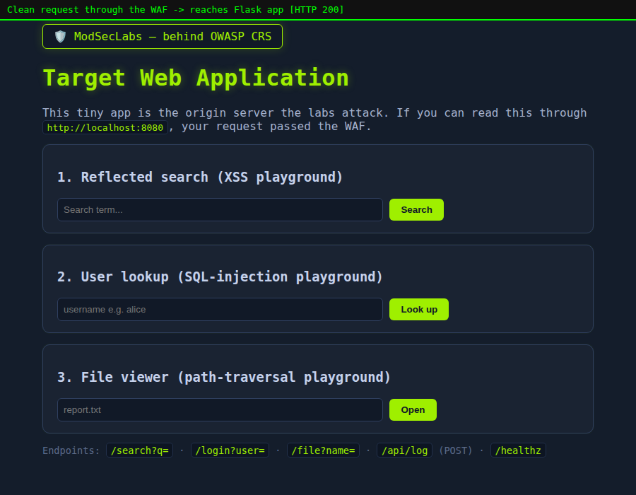
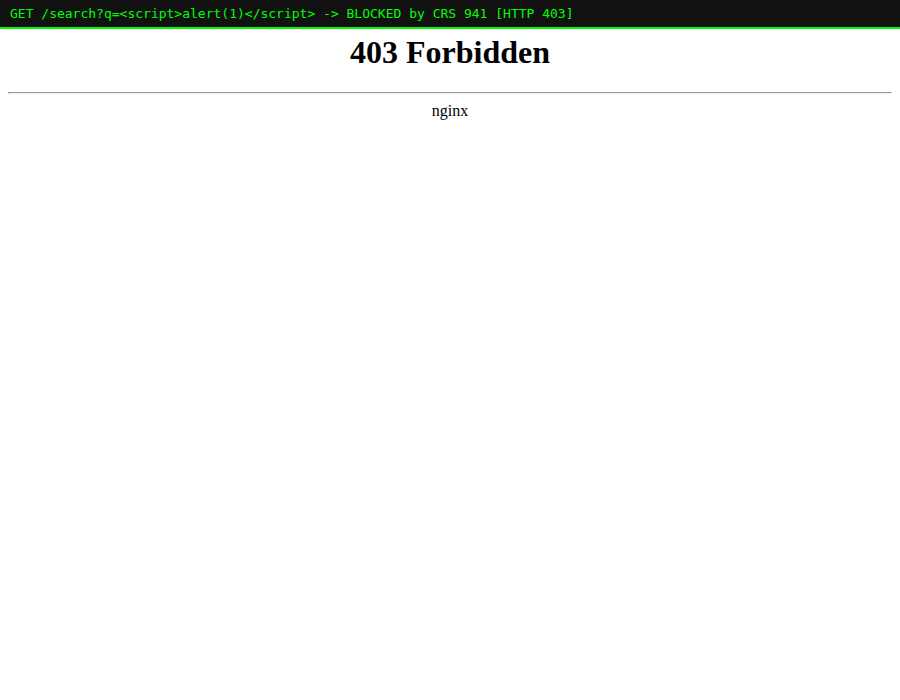

# Lab 01 — Meet ModSecurity & the OWASP Core Rule Set

> **Level:** Beginner
> **Goal:** Understand what a WAF is, stand up the lab stack, and watch your
> very first request get either *allowed* or *blocked*.
> **Time:** ~20 minutes

---

## 1. Theory first — what problem are we solving?

As a web developer you already fix vulnerabilities *in code* — you escape
output, you use parameterised SQL queries, you validate input. That is the
right place to fix things. So why add a WAF?

Because in the real world:

- You don't control every line of code (third-party libraries, legacy
  endpoints, a plugin someone installed).
- A brand-new vulnerability (a "0-day" / fresh CVE) can be published on a
  Monday and exploited worldwide by Tuesday — long before you can patch,
  test and redeploy.
- Some bugs live in the framework or the runtime itself.

A **WAF (Web Application Firewall)** sits *in front of* your app and inspects
every HTTP request **before your code ever runs**. If a request looks like an
attack, the WAF can reject it. Think of it as a bouncer at the door who reads
each request and turns away the obviously malicious ones.

```
   Attacker / User
        │  HTTP request
        ▼
 ┌─────────────────────────┐
 │  nginx + ModSecurity     │  ◄── the WAF: inspects the request
 │  + OWASP Core Rule Set   │      against hundreds of rules
 └─────────────────────────┘
        │  (only if clean)
        ▼
 ┌─────────────────────────┐
 │  Your Flask app (:5000)  │  ◄── your code only sees safe traffic
 └─────────────────────────┘
```

### The three pieces

| Piece | What it is | Analogy |
|-------|-----------|---------|
| **ModSecurity** | An open-source *engine* that can inspect HTTP requests/responses and act on them. On its own it has **no rules** — it just knows *how* to match rules. | The bouncer's brain |
| **OWASP Core Rule Set (CRS)** | A community-maintained *set of rules* describing what attacks look like (SQLi, XSS, path traversal, etc.). This is what makes ModSecurity actually useful. | The bouncer's rulebook |
| **nginx (or Apache)** | The web server ModSecurity plugs into. The `owasp/modsecurity-crs:nginx` image bundles all three, pre-wired. | The doorway itself |

> **Why this matters:** People say "I installed ModSecurity" and think they
> are protected. ModSecurity **without** a rule set blocks nothing. The
> protection comes from the **CRS**. The Docker image you already have bundles
> both, which is exactly why we use it.

---

## 2. The lab stack

Everything in these labs uses two containers:

- **`app`** — a tiny, deliberately naive Flask web app (the thing we protect).
  It has endpoints that *would* be vulnerable to XSS, SQLi and path traversal
  if nothing stood in front of it.
- **`waf`** — the `owasp/modsecurity-crs:nginx` container. It listens on
  **:8080**, runs each request through the CRS, and only forwards clean
  requests to the Flask app.

You attack **`http://localhost:8080`** (through the WAF). If you ever want to
see the *unprotected* app for comparison, it is on **`http://localhost:5000`**.

---

## 3. Practical steps

### Step 3.1 — Get the image (you already have it)

```bash
docker pull owasp/modsecurity-crs:nginx
docker images | grep modsecurity
```

### Step 3.2 — Start the whole stack

From the repository root:

```bash
docker compose up -d --build
```

This builds the Flask app image and starts both containers. Check they are up:

```bash
docker compose ps
```

You should see `modseclabs-app` and `modseclabs-waf` running.

### Step 3.3 — Send your first (clean) request

```bash
curl -i http://localhost:8080/
```

You get back `HTTP/1.1 200 OK` and the app's HTML. The request was clean, so
the WAF passed it through. In a browser it looks like this:



### Step 3.4 — Send your first *attack*

Now ask for the same app but smuggle a classic cross-site-scripting payload
in the `q` parameter:

```bash
curl -i "http://localhost:8080/search?q=<script>alert(1)</script>"
```

This time the response is **`HTTP/1.1 403 Forbidden`** — the WAF recognised
the `<script>` payload and refused to forward it. Your Flask code never ran.



> **Where the theory shows up:** The `403` did **not** come from your Flask
> app — Flask never saw the request. It came from ModSecurity applying a CRS
> rule at the front door. That is the whole idea of a WAF in one screenshot.

### Step 3.5 — Prove the app itself is defenceless

To really appreciate the WAF, hit the app **directly**, bypassing the WAF:

```bash
curl -i "http://localhost:5000/search?q=<script>alert(1)</script>"
```

Now you get `200 OK` and your `<script>` tag is reflected right back into the
HTML — a working reflected-XSS. Same app, same payload; the only difference is
whether the WAF was in the path.

---

## 4. What just happened, rule by rule

When the attack was blocked, ModSecurity wrote an **audit log** entry. View it:

```bash
docker logs modseclabs-waf | tail -n 40
```

Buried in there you'll find the exact rule that fired:

```
id "941100"  msg "XSS Attack Detected via libinjection"
id "949110"  msg "Inbound Anomaly Score Exceeded (Total Score: 20)"
```

Two important ideas are already visible here, and we'll go deep on both in
later labs:

- **`941100`** — a rule from the *XSS* family (`941xxx`) spotted the attack.
- **`949110`** — CRS didn't block on the first hit; it *added up* a score and
  blocked once the total crossed a threshold. This is **anomaly scoring**
  (Lab 02 and Lab 05).

---

## 5. Clean up (optional)

```bash
docker compose down
```

---

## 6. Recap

- A **WAF** inspects HTTP traffic *before your code runs*.
- **ModSecurity = engine**, **CRS = rules**. You need both; the Docker image
  bundles both.
- A clean request → `200`; a recognised attack → `403`, and your app never
  sees it.
- Every block is explained in the **audit log**, tied to a numbered rule.

**Next:** In Lab 02 we stop *blocking* and switch the WAF into
**DetectionOnly** mode, learn to read the audit log properly, and understand
the anomaly score that decided the block.
