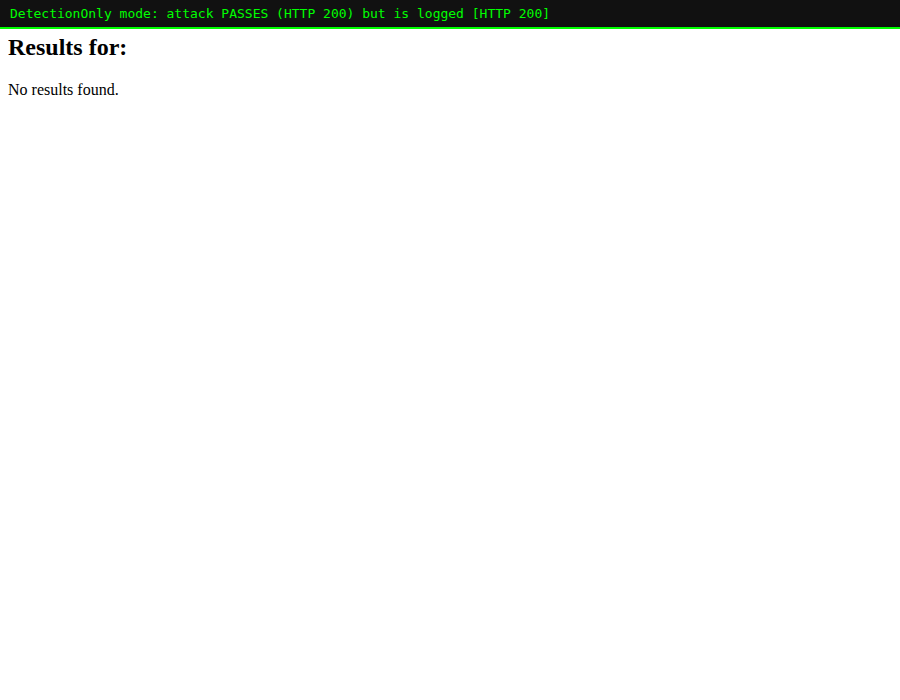

# Lab 02 — Detection vs Prevention & Reading the Audit Log

> **Level:** Beginner
> **Goal:** Understand the three engine modes, learn to read a ModSecurity
> audit log, and understand the **anomaly score** that decides a block.
> **Time:** ~30 minutes

---

## 1. Theory — the rule engine has three modes

ModSecurity's behaviour is controlled by one master switch, the
`SecRuleEngine` directive. It has three settings:

| Mode | What it does | When you use it |
|------|-------------|-----------------|
| `On` | Rules run **and** requests can be blocked. | Production, once you trust your tuning. |
| `DetectionOnly` | Rules run and everything is **logged**, but nothing is ever blocked. | **Always start here.** Watch what *would* be blocked before you turn on blocking. |
| `Off` | The engine is disabled. No inspection at all. | Debugging / temporarily bypassing. |

> **Why this matters — the #1 rule of deploying a WAF:** Never switch a WAF
> straight to `On` in front of a real app. You *will* have false positives
> (legitimate requests that look suspicious). Run in `DetectionOnly` first,
> read the logs, fix the false positives (Lab 07), and only then enable
> blocking. Flipping straight to `On` is how teams take down their own site
> on day one.

In the lab stack the mode is set by the `MODSEC_RULE_ENGINE` environment
variable, which the container maps to `SecRuleEngine`.

---

## 2. Practical — see the difference with your own eyes

We'll run the **same attack** against two WAFs that differ only in mode.

### Step 2.1 — Start a DetectionOnly WAF alongside the blocking one

The main stack (`:8080`) runs in `On` mode. Start a second WAF in
`DetectionOnly` mode on `:8081`:

```bash
docker run -d --name modseclabs-waf-detect \
  --add-host=host.docker.internal:host-gateway \
  -e BACKEND="http://host.docker.internal:5000" -e PORT=8080 \
  -e MODSEC_RULE_ENGINE=DetectionOnly -e PARANOIA=1 -e ANOMALY_INBOUND=5 \
  -e MODSEC_AUDIT_LOG=/dev/stdout -e MODSEC_AUDIT_ENGINE=RelevantOnly \
  -p 8081:8080 owasp/modsecurity-crs:nginx
```

> In `docker compose`, you'd instead just change `MODSEC_RULE_ENGINE` on the
> `waf` service and `docker compose up -d`. We use a second container here so
> you can compare both live.

### Step 2.2 — Fire the same XSS payload at both

```bash
# Blocking mode
curl -s -o /dev/null -w "Prevention (:8080) -> HTTP %{http_code}\n" \
  "http://localhost:8080/search?q=<script>alert(1)</script>"

# Detection-only mode
curl -s -o /dev/null -w "DetectionOnly (:8081) -> HTTP %{http_code}\n" \
  "http://localhost:8081/search?q=<script>alert(1)</script>"
```

You'll see:

```
Prevention (:8080) -> HTTP 403
DetectionOnly (:8081) -> HTTP 200
```

Same rule fires in both. The difference is only the **consequence**. In
DetectionOnly the malicious request sails through to the app:



> **Where the theory shows up:** Both engines *detected* the attack — check
> the logs of either and rule `941100` fired. Detection ≠ prevention. The
> engine mode is the switch between "know about it" and "stop it".

---

## 3. Anatomy of an audit log entry

This is the single most useful skill in operating a WAF. When something is
blocked (or would be), ModSecurity writes a JSON audit record. View it:

```bash
docker logs modseclabs-waf | tail -n 40
```

The record is big, but you only need a handful of fields. Here are the ones
that matter, from a real block in this lab:

```json
"ruleId": "941100",
"msg":    "XSS Attack Detected via libinjection",
"data":   "Matched Data: XSS data found within ARGS:q: <script>alert(1)</script>",
"severity":"2",
"tags":   ["attack-xss","paranoia-level/1","OWASP_CRS/ATTACK-XSS"]
```

| Field | Meaning | Why you care |
|-------|---------|--------------|
| `ruleId` | The numeric ID of the rule that fired (`941100`). | This is the handle you use to tune, disable, or research a rule. |
| `msg` | Human description of what was detected. | Tells you the attack class. |
| `data` | **Exactly** what matched, and in which variable (`ARGS:q`). | Lets you confirm true vs false positive at a glance. |
| `severity` | How serious CRS thinks it is (lower number = worse). | Feeds the anomaly score. |
| `tags` | Categories incl. the paranoia level that caught it. | Used for bulk exclusions and reporting. |

### Rule ID families (memorise these ranges)

CRS groups rules by attack type using the leading digits of the ID:

| Range | Attack family |
|-------|---------------|
| `913xxx` | Scanner / bot detection |
| `920xxx`–`921xxx` | Protocol enforcement (malformed HTTP) |
| `930xxx` | Local File Inclusion / path traversal |
| `931xxx` | Remote File Inclusion |
| `932xxx` | Remote Code Execution (shell injection) |
| `941xxx` | Cross-Site Scripting (XSS) |
| `942xxx` | SQL Injection |
| `943xxx` | Session fixation |
| `944xxx` | Java attacks (incl. Log4Shell — see Lab 08) |
| `949xxx` | **Blocking evaluation** (the anomaly-score decision) |

---

## 4. Theory — anomaly scoring (the heart of CRS)

Look again at the Lab 01 block. It contained **two** rule hits:

```
941100  XSS Attack Detected                     (severity CRITICAL -> +5)
949110  Inbound Anomaly Score Exceeded (Total Score: 20)
```

CRS 4.x does **not** block the instant one rule matches. Instead:

1. Every matching rule **adds points** to a running *anomaly score*. A
   `CRITICAL` rule adds **5**, `ERROR` adds 4, `WARNING` 3, `NOTICE` 2.
2. At the very end (rule `949110`), CRS compares the total against the
   **inbound anomaly threshold** (`ANOMALY_INBOUND`, default **5**).
3. If `score >= threshold`, the request is blocked. Otherwise it passes.

```
   payload matches 941100 (+5), 941110 (+5), 941160 (+5), 941390 (+5)
                                   │
                                   ▼
                      total inbound score = 20
                                   │
        949110:  is 20 >= threshold(5) ?   YES  ->  403 Forbidden
```

> **Why this design matters:** A single fuzzy rule firing on its own might be a
> false positive. But a request that trips *four* XSS rules is almost
> certainly an attack. Scoring lets CRS be **strict about real attacks and
> forgiving about borderline traffic** by tuning **one number** (the
> threshold) instead of editing hundreds of rules. You'll tune this threshold
> and the "paranoia level" that changes how many rules run in Lab 05.

The threshold is a dial:

- **Lower threshold (e.g. 3)** → blocks more aggressively → more false positives.
- **Higher threshold (e.g. 10)** → more permissive → risks missing real attacks.

---

## 5. Exercises

1. Fire the SQLi payload `admin' OR '1'='1` at `:8081` and confirm it returns
   `200` but still logs rule `942100`.
2. In the audit log, find the `data` field and confirm it shows *your* exact
   payload. This is how you distinguish a real attack from a false positive.
3. Change the main stack to `DetectionOnly` (edit `MODSEC_RULE_ENGINE` in
   `docker-compose.yml`, then `docker compose up -d`) and confirm the XSS now
   returns `200`.

### Clean up the extra container

```bash
docker rm -f modseclabs-waf-detect
```

---

## 6. Recap

- `SecRuleEngine`: `On` (block), `DetectionOnly` (log only), `Off` (disabled).
  **Always start in DetectionOnly.**
- The audit log's `ruleId`, `msg` and `data` fields tell you *what* fired and
  *why* — learn to read them.
- Rule ID ranges map to attack families (941 = XSS, 942 = SQLi, …).
- CRS blocks on an **accumulated anomaly score** crossing a threshold, not on
  a single rule hit.

**Next:** Lab 03 dives into a full attack family — SQL injection — and shows
exactly which payloads trip which `942xxx` rules.
