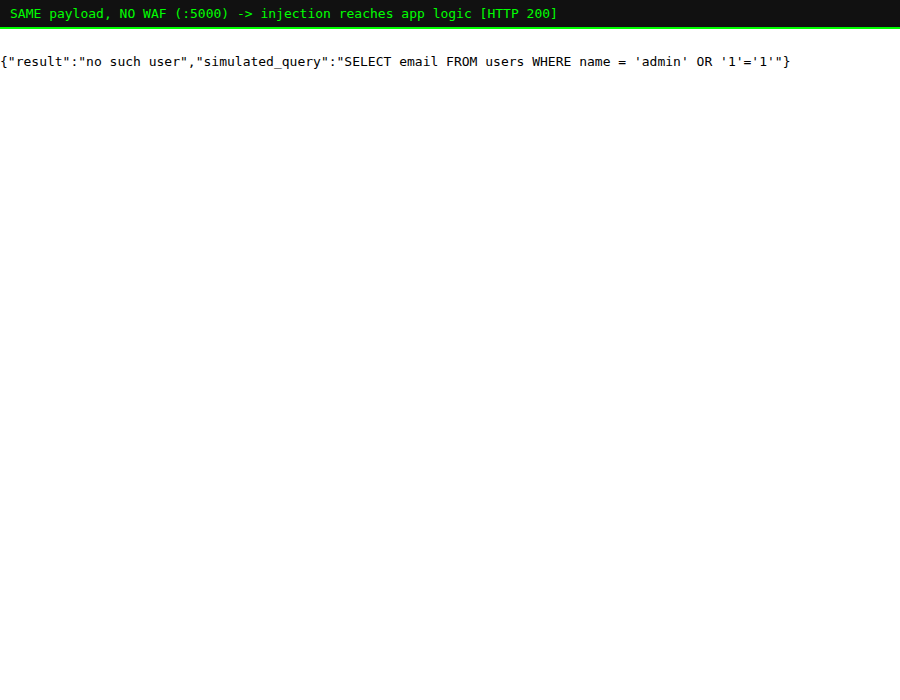
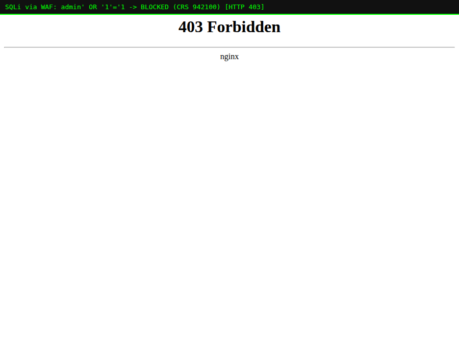

# Lab 03 — Stopping SQL Injection (the `942xxx` family)

> **Level:** Beginner → Intermediate
> **Goal:** Understand SQL injection, watch CRS block a range of SQLi payloads,
> and connect each block to a specific rule.
> **Time:** ~30 minutes

---

## 1. Theory — what is SQL injection?

Most apps build database queries from user input. A naive login lookup might do:

```python
query = "SELECT email FROM users WHERE name = '" + user_input + "'"
```

If `user_input` is `alice`, the query is harmless:

```sql
SELECT email FROM users WHERE name = 'alice'
```

But if an attacker sends `user_input = admin' OR '1'='1`, the string becomes:

```sql
SELECT email FROM users WHERE name = 'admin' OR '1'='1'
```

`'1'='1'` is always true, so the `WHERE` clause matches **every** row. The
attacker just bypassed the filter. Worse payloads can read other tables
(`UNION SELECT`), destroy data (`; DROP TABLE users; --`), or extract the
database one bit at a time (blind SQLi).

SQL injection has sat at or near the top of the **OWASP Top 10** for two
decades. It's #3 ("Injection") in the current list.

> **Why this matters for you as a dev:** The *correct* fix is parameterised
> queries / prepared statements — never concatenate input into SQL. A WAF does
> **not** replace that fix. It's a **safety net**: it catches injection
> attempts against code you haven't fixed yet, third-party endpoints, and
> brand-new payloads, buying you time to patch properly.

---

## 2. See the vulnerability without the WAF

Our lab app's `/login` endpoint simulates that exact naive query (it echoes the
SQL instead of running it, so the demo is safe). Hit it **directly**, bypassing
the WAF on `:5000`:

```bash
curl "http://localhost:5000/login?user=admin' OR '1'='1"
```

The app happily builds the injected query:



The `OR '1'='1` is now part of the query logic. In a real app backed by a real
database, this is a full authentication bypass.

---

## 3. Now put the WAF in front

Send the identical payload through the WAF on `:8080`:

```bash
curl -i "http://localhost:8080/login?user=admin' OR '1'='1"
```

`HTTP/1.1 403 Forbidden`. The payload never reached the app.



> **Where the theory shows up:** The injection string that *changed the meaning
> of the SQL query* is exactly the pattern CRS looks for. It matched before
> your query-building code ever ran.

---

## 4. Which rule caught it? — the `942xxx` family

Check the log:

```bash
docker logs modseclabs-waf | grep -o '"ruleId":"942[0-9]*"' | sort -u
```

Different payloads trip different rules. A few you'll meet:

| Rule ID | Detects |
|---------|---------|
| `942100` | Generic SQLi via **libinjection** (a dedicated SQLi-detection library) |
| `942190` | SQL comment / basic injection keywords |
| `942260` | `OR`/`AND` boolean-logic injections (`' OR '1'='1`) |
| `942350` | Stored-procedure / `UNION` style injection |
| `942360` | `DROP` / `ALTER` / other DDL keywords |
| `942540` | Injection inside a SQL string terminator |

> **Deep-dive — libinjection (`942100`):** Older WAFs matched SQLi with giant
> fragile regexes. CRS instead uses **libinjection**, which *tokenises* the
> input the way a SQL parser would and asks "does this look like SQL syntax?".
> It's far harder to bypass than a regex and produces fewer false positives.
> This is why `942100` catches so many variants at once.

---

## 5. Practical — walk through a range of payloads

Run each and note the status code (all should be `403` through `:8080`):

```bash
# 1. Boolean bypass
curl -s -o /dev/null -w "%{http_code}  boolean-OR\n"   "http://localhost:8080/login?user=admin' OR '1'='1"

# 2. UNION-based extraction
curl -s -o /dev/null -w "%{http_code}  union\n"        "http://localhost:8080/login?user=x' UNION SELECT password FROM users--"

# 3. Stacked / destructive query
curl -s -o /dev/null -w "%{http_code}  drop-table\n"   "http://localhost:8080/login?user=1'; DROP TABLE users;--"

# 4. Comment-based
curl -s -o /dev/null -w "%{http_code}  comment\n"      "http://localhost:8080/login?user=admin'--"

# 5. A LEGITIMATE lookup (should be 200!)
curl -s -o /dev/null -w "%{http_code}  legit lookup\n" "http://localhost:8080/login?user=alice"
```

Expected:

```
403  boolean-OR
403  union
403  drop-table
403  comment
200  legit lookup
```

That last line is the important one: a normal username (`alice`) sails through.
The WAF is distinguishing *injection syntax* from *ordinary input* — not just
blocking the word "user".

> **Try to break it (offensive mindset):** Attackers evade WAFs by *encoding*
> payloads. Try URL-encoding, adding inline comments (`OR/**/1=1`), or changing
> case (`oR`). With libinjection at paranoia level 1 most of these are still
> caught — but some advanced evasions only get caught at **higher paranoia
> levels**, which is exactly what Lab 05 is about.

---

## 6. Recap

- SQL injection changes the *meaning* of a query by injecting SQL syntax into
  input that gets concatenated into the query string.
- The real fix is **parameterised queries**; the WAF is a **safety net**.
- CRS catches SQLi with the `942xxx` family, powered by **libinjection**
  (`942100`) plus keyword rules for `UNION`, `DROP`, comments, etc.
- Legitimate input still passes — the WAF matches injection *syntax*, not
  keywords.

**Next:** Lab 04 does the same deep-dive for **Cross-Site Scripting** and the
`941xxx` rules.
