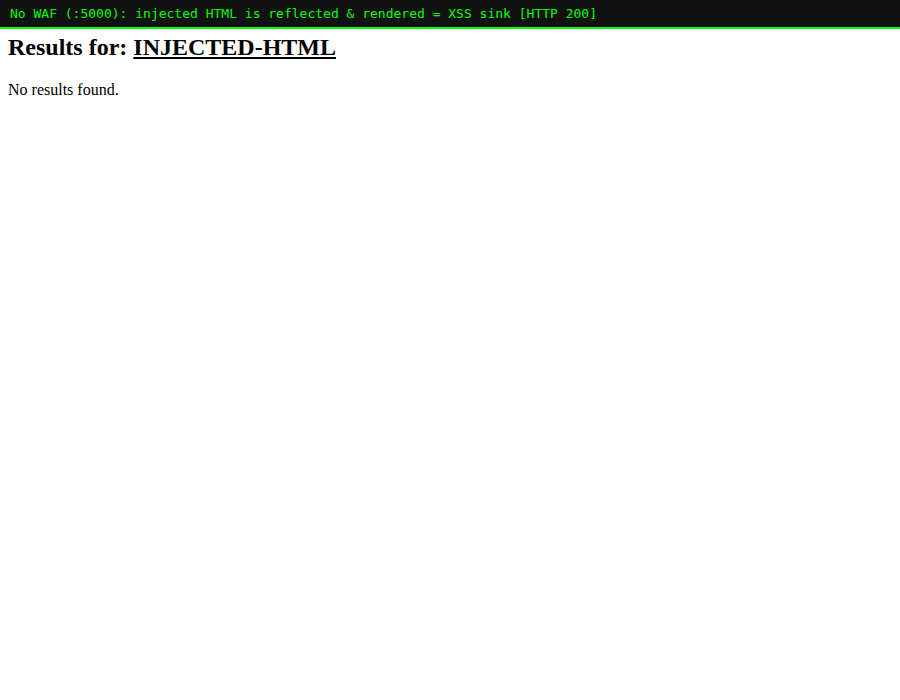

# Lab 04 — Stopping Cross-Site Scripting (the `941xxx` family)

> **Level:** Beginner → Intermediate
> **Goal:** Understand reflected XSS, watch CRS block script payloads, and see
> why multiple rules stack up to force the block.
> **Time:** ~30 minutes

---

## 1. Theory — what is XSS?

**Cross-Site Scripting (XSS)** is when an attacker gets *their* JavaScript to
run in *another user's* browser, in the context of your site. Because the
script runs as your origin, it can steal cookies/session tokens, log
keystrokes, rewrite the page, or make requests as the victim.

The classic form is **reflected XSS**: user input is echoed straight back into
the HTML response without escaping. Our app's `/search` endpoint does exactly
that:

```python
return "<h2>Results for: " + q + "</h2>"   # q is NOT escaped
```

Send `q=<b><u>INJECTED-HTML</u></b>` and the app pastes those tags into the
page, where the browser renders them as real markup:



That "INJECTED-HTML" is bold and underlined because **our tags became part of
the page**. Swap `<b>` for `<script>` and instead of formatting you get code
execution.

> **Why this matters for you as a dev:** The real fix is **context-aware output
> encoding** — escape `<`, `>`, `&`, quotes when inserting user data into HTML
> (Jinja2's autoescaping, `|e`, a templating engine used correctly). A
> Content-Security-Policy header is a strong second layer. The WAF is the
> **third** layer: it blocks known script-injection patterns before they reach
> a page that forgot to escape.

---

## 2. Put the WAF in front

Same payload family, now through `:8080`:

```bash
curl -i "http://localhost:8080/search?q=<script>alert(1)</script>"
```

`HTTP/1.1 403 Forbidden` — blocked.


---

## 3. Why *four* rules fired — anomaly scoring in action

Check the log for the XSS attempt:

```bash
docker logs modseclabs-waf | grep -o '"ruleId":"941[0-9]*"' | sort -u
```

You'll typically see several:

| Rule ID | What it detected in `<script>alert(1)</script>` |
|---------|--------------------------------------------------|
| `941100` | XSS via **libinjection** (generic detector) |
| `941110` | The `<script ...>` tag vector |
| `941160` | NoScript-style HTML-injection heuristic (`<script`) |
| `941390` | A JavaScript method call (`alert(`) |

Each is `CRITICAL` (+5). Together they push the inbound anomaly score to **20**,
far past the threshold of 5, and rule `949110` issues the block. Recall from
Lab 02:

```
941100(+5) + 941110(+5) + 941160(+5) + 941390(+5) = 20
949110:  20 >= 5  ->  403
```

> **Where the theory shows up:** This is *why* scoring exists. A payload that is
> unambiguously an attack lights up many rules at once, so the score rockets
> past the threshold. A borderline string that trips only one rule (+3 or +5)
> may sit under a higher threshold — which is how CRS keeps false positives
> down while still nuking obvious attacks.

---

## 4. Practical — a spread of XSS payloads

```bash
# 1. Script tag
curl -s -o /dev/null -w "%{http_code}  script-tag\n"   "http://localhost:8080/search?q=<script>alert(1)</script>"

# 2. Event-handler injection (no <script> needed)
curl -s -o /dev/null -w "%{http_code}  img-onerror\n"  "http://localhost:8080/search?q="

# 3. javascript: URI
curl -s -o /dev/null -w "%{http_code}  js-uri\n"       "http://localhost:8080/search?q=<a href=javascript:alert(1)>x</a>"

# 4. SVG vector
curl -s -o /dev/null -w "%{http_code}  svg\n"          "http://localhost:8080/search?q=<svg/onload=alert(1)>"

# 5. A LEGITIMATE search (should be 200)
curl -s -o /dev/null -w "%{http_code}  legit search\n" "http://localhost:8080/search?q=modsecurity+tutorial"
```

Expected: the first four are `403`, the honest search is `200`.

> **Note the `` and `<svg onload>` cases:** XSS is *not* just
> `<script>`. Any way to get the browser to execute JS — event handlers,
> `javascript:` URIs, SVG — is a vector. This is exactly why a hand-rolled
> "block `<script>`" filter is useless and why you want a maintained rule set
> that knows all these vectors.

---

## 5. Exercise — watch the score climb

1. Send a *single-signal* payload like `q=<b>hi</b>` through `:8080`. Does it
   get blocked? Check the log — how many points did it score, and did it cross
   the threshold?
2. Now send the full `<script>alert(1)</script>`. Compare the number of rules
   that fired and the total score.
3. This difference is the whole reason CRS uses scoring instead of
   block-on-first-match.

---

## 6. Recap

- XSS = attacker's JavaScript running in a victim's browser as your origin.
- Reflected XSS happens when input is echoed into HTML without escaping.
- Real fixes: **output encoding** + **CSP**. The WAF (`941xxx`) is a safety net.
- XSS has many vectors (`<script>`, `onerror`, `javascript:`, `<svg>`); a
  maintained rule set covers them all.
- A clear attack trips **multiple** rules → high anomaly score → block; honest
  input passes.

**Next:** Lab 05 covers path traversal / LFI **and** introduces the two dials
that govern how strict the whole WAF is: **paranoia levels** and the **anomaly
threshold**.
