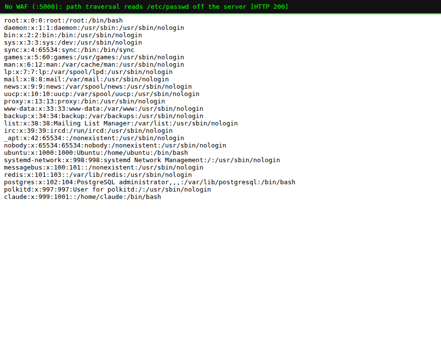
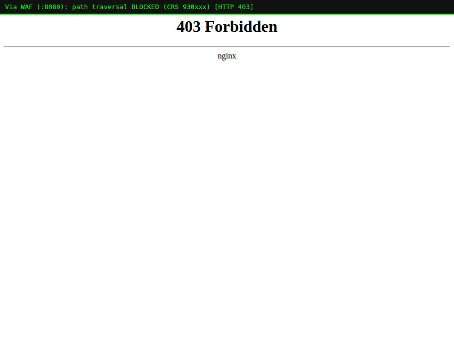

# Lab 05 — Path Traversal, Paranoia Levels & the Threshold Dial

> **Level:** Intermediate
> **Goal:** Block path traversal, then learn the two dials an operator turns in
> production — **paranoia level** and **anomaly threshold** — and the trade-off
> they control.
> **Time:** ~40 minutes
> **Operator focus:** This is where you stop being a user of CRS and start
> *configuring* it. These two settings are the first thing you decide on any
> real deployment.

---

## 1. The attack — path traversal / LFI

Our `/file` endpoint reads a file from a `data/` directory:

```python
target = os.path.join(base, name)   # name comes straight from the user
open(target)
```

If `name` is `report.txt`, fine. If `name` is `../../../../../../etc/passwd`,
the `../` sequences climb out of `data/` and up to the filesystem root. Hit the
**unprotected** app:

```bash
curl "http://localhost:5000/file?name=../../../../../../etc/passwd"
```



The server just handed a remote attacker its user database. This is **Local
File Inclusion (LFI)** / **path traversal** — OWASP calls it Broken Access
Control / Injection depending on the variant.

Through the WAF it's dead on arrival:

```bash
curl -i "http://localhost:8080/file?name=../../../../../../etc/passwd"   # 403
```



Rules `930100`/`930110`/`930120` (the LFI family) recognise the `../` and
well-known target paths (`/etc/passwd`, `/proc/…`).

> **Real fix (dev side):** never build a path from raw input — canonicalise and
> confirm it stays inside an allow-listed base directory
> (`os.path.realpath` + prefix check), or map user input to an ID, not a path.
> The WAF is the net for the endpoints you haven't hardened yet.

---

## 2. Dial #1 — Paranoia Level (how many rules run)

This is the single most important operator decision in CRS. The **paranoia
level (PL)**, set in `crs-setup.conf` (or `PARANOIA` env var in this image),
runs from **1 to 4** and controls **how aggressive** the rule set is.

| PL | Character | What it adds | Who runs it |
|----|-----------|--------------|-------------|
| **1** | Default, minimal false positives | Well-proven rules only | Almost everyone, in production |
| **2** | Stricter | More SQLi/XSS heuristics, stricter char checks | Mature deployments after tuning |
| **3** | Aggressive | Catches evasions, but noisy | High-security apps, well-tuned |
| **4** | Paranoid | Blocks lots of borderline input | Locked-down internal apps; expect heavy tuning |

The higher the PL, the **more rules evaluate each request** — so you catch more
evasions, but you also flag more legitimate traffic.

> **Why this matters:** A higher paranoia level is *not* "just better security."
> Each level up trades false negatives for **false positives**. Turning it up
> without doing the tuning work (Lab 07) means blocking real customers. In
> industry the standard path is: **deploy at PL1, get clean, then consider PL2.**

### Try it

Start WAFs at PL1, PL2 and PL4:

```bash
for pl in 1 2 4; do
  docker run -d --name modseclabs-waf-pl$pl \
    --add-host=host.docker.internal:host-gateway \
    -e BACKEND="http://host.docker.internal:5000" -e PORT=8080 \
    -e MODSEC_RULE_ENGINE=On -e PARANOIA=$pl -e ANOMALY_INBOUND=5 \
    -e MODSEC_AUDIT_LOG=/dev/stdout -e MODSEC_AUDIT_ENGINE=RelevantOnly \
    -p 808$pl:8080 owasp/modsecurity-crs:nginx
done
```

Now watch a **legitimate** product search get more suspicious as PL rises. Some
benign strings are caught even at PL1 — a classic false positive:

```bash
curl -s -o /dev/null -w "%{http_code}\n" --get "http://localhost:8081/search" \
  --data-urlencode "q=Compare and select from our items"
```

That returns **403** — the phrase "select … from" tripped the SQLi rules even
though it's an honest search. **This is the false positive you will spend real
time fixing in Lab 07.** It's not a bug; it's the fundamental tension of pattern
matching, and managing it is the operator's core job.

---

## 3. Dial #2 — Anomaly Threshold (how much suspicion = block)

Recall from Lab 02: rules add points; rule `949110` blocks when the total
crosses the **inbound anomaly threshold** (`SecAction … setvar:tx.inbound_anomaly_score_threshold`,
or `ANOMALY_INBOUND` here). Default = **5**, which equals **one CRITICAL rule**.

| Threshold | Effect |
|-----------|--------|
| **5** (default) | One critical hit blocks. Strict. |
| **10** | Needs ~two critical hits. More forgiving; fewer false positives. |
| **20+** | Very permissive; only egregious multi-rule attacks blocked. |

Operators often **pair** the two dials: raise the paranoia level for coverage,
but also raise the threshold so a single borderline rule doesn't block on its
own. For example "PL2 with threshold 10" is a common, well-balanced production
posture.

### Try it

Run one WAF at PL1 with a *relaxed* threshold of 15:

```bash
docker run -d --name modseclabs-waf-thresh \
  --add-host=host.docker.internal:host-gateway \
  -e BACKEND="http://host.docker.internal:5000" -e PORT=8080 \
  -e MODSEC_RULE_ENGINE=On -e PARANOIA=1 -e ANOMALY_INBOUND=15 \
  -e MODSEC_AUDIT_LOG=/dev/stdout -e MODSEC_AUDIT_ENGINE=RelevantOnly \
  -p 8090:8080 owasp/modsecurity-crs:nginx
sleep 6

# A payload that scores ~5 (one rule) now PASSES because threshold is 15:
curl -s -o /dev/null -w "relaxed(15) -> %{http_code}\n" \
  --get "http://localhost:8090/search" --data-urlencode "q=Compare and select from our items"
```

Same request that was `403` at threshold 5 may now be `200` at threshold 15 —
you traded strictness for fewer false positives, globally, with one number.

> **The operator's mental model:** *Paranoia level* decides **which** rules ask
> questions; *threshold* decides **how many** "yes, suspicious" answers it takes
> to block. Tuning a WAF is mostly moving these two dials and then surgically
> excluding the specific rules that still misfire (Lab 07).

---

## 4. Where these live in a real config

In a non-Docker install (or when you mount your own config), these are plain
directives you version-control:

```apache
# crs-setup.conf
SecAction "id:900000, phase:1, nolog, pass, t:none, \
  setvar:tx.blocking_paranoia_level=1"

SecAction "id:900110, phase:1, nolog, pass, t:none, \
  setvar:tx.inbound_anomaly_score_threshold=5, \
  setvar:tx.outbound_anomaly_score_threshold=4"
```

The Docker image simply generates these from the `PARANOIA` and
`ANOMALY_INBOUND` env vars at startup. **Knowing the underlying directives
matters** because in production you'll often mount a hand-edited
`crs-setup.conf` rather than rely on env vars.

### Clean up the extra containers

```bash
docker rm -f modseclabs-waf-pl1 modseclabs-waf-pl2 modseclabs-waf-pl4 \
              modseclabs-waf-thresh 2>/dev/null
```

---

## 5. Recap

- Path traversal (`930xxx`) escapes a directory with `../`; the WAF blocks the
  pattern before your file-reading code runs.
- **Paranoia level (1–4)** = how many rules run = coverage vs false positives.
  **Start at PL1 in production.**
- **Anomaly threshold** = how much accumulated suspicion triggers a block.
  Raise it to be more forgiving.
- These two directives live in `crs-setup.conf` and are the operator's primary
  dials. Turning paranoia up **requires** tuning work — which is Lab 07.

**Next:** Lab 06 — you stop *configuring* CRS and start *writing your own
rules* in the ModSecurity rule language (`SecRule`).
