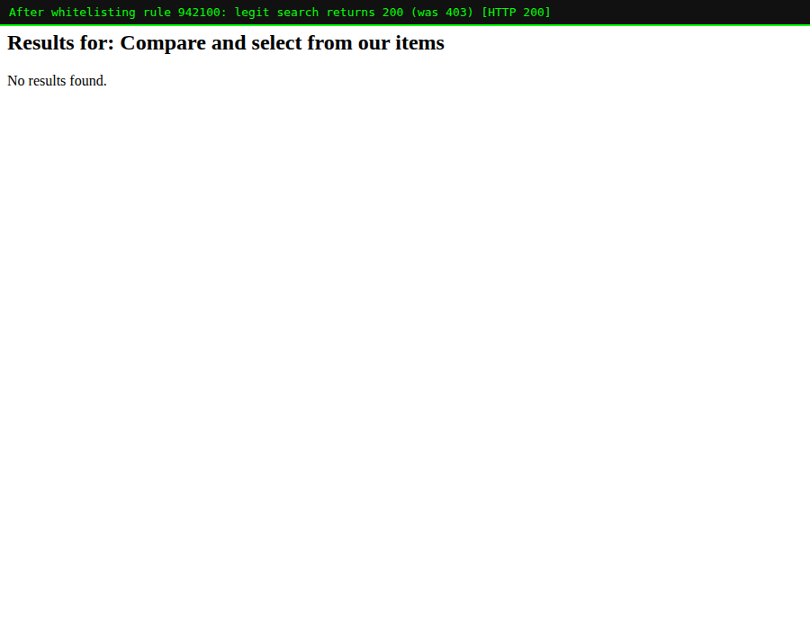

# Lab 09 — Whitelisting a Rule ID (so a Real User Isn't Blocked)

> **Level:** Intermediate
> **Goal:** When CRS blocks a *legitimate* request, whitelist the offending
> **rule ID** so that user gets through — and understand the trade-off you just
> made.
> **Time:** ~30 minutes
> **Operator focus:** This is the fastest tool in the tuning toolbox. It's also
> the bluntest, so knowing *when* to reach for it (and when to reach for the
> scoped exclusion from Lab 07 instead) is the real skill.

---

## 1. Theory — "whitelisting" vs "blacklisting"

CRS is a **blocklist**: it describes what *bad* looks like and blocks matches.
**Whitelisting** is the opposite instruction — you tell the WAF *"this specific
thing is fine, do not block it."*

You whitelist at different granularities:

| You whitelist… | Directive | Effect |
|----------------|-----------|--------|
| **A rule ID** | `SecRuleRemoveById 942100` | That rule never fires, anywhere |
| **A range of IDs** | `SecRuleRemoveById 920200-920210` | A whole block of rules off |
| **A rule family (tag)** | `SecRuleRemoveByTag "attack-sqli"` | Every rule with that tag off |
| **A trusted client** | `SecRule REMOTE_ADDR … ctl:ruleEngine=…` | Requests from that source skip enforcement |

> **Whitelisting a rule ID vs. the scoped exclusion of Lab 07:** In Lab 07 we
> used `ctl:ruleRemoveTargetById=942100;ARGS:q` to disable a rule **only for one
> argument on one path**. `SecRuleRemoveById 942100` disables it **everywhere**.
> The scoped version is safer; the global version is simpler. Reach for the
> global one only when the rule is wrong for your app *as a whole* — otherwise
> prefer the scalpel.

---

## 2. Reproduce the block

A legitimate product search contains the words "select … from", which the
SQLi rule `942100` mistakes for an attack. Against the normal stack (`:8080`):

```bash
curl -s -o /dev/null -w "%{http_code}\n" \
  --get "http://localhost:8080/search" \
  --data-urlencode "q=Compare and select from our items"     # 403
```

Confirm the culprit rule ID from the log (never guess it):

```bash
docker logs modseclabs-waf | grep -o '"ruleId":"[0-9]*"[^}]*"data":"[^"]*"' | tail -1
# "ruleId":"942100", ... "data":"Matched Data: n&Ekn found within ARGS:q: Compare and select from our items"
```

The rule ID to whitelist is **`942100`**.

---

## 3. Whitelist the rule ID

Create `rules/WHITELIST.conf`:

```apache
# Whitelist a single rule ID globally.
SecRuleRemoveById 942100

# You can also whitelist a RANGE (inclusive):
SecRuleRemoveById 920200-920210

# ...or every rule carrying a tag (powerful -- usually too broad):
# SecRuleRemoveByTag "attack-sqli"
```

> **Load order matters (again).** `SecRuleRemoveById` must be processed **after**
> the rule it targets has been *defined* but its removal applies at config load.
> The safe, conventional home is a `REQUEST-900-*` file, which loads before the
> `9xx` detection rules — CRS handles the removal correctly from there.

Start a WAF with the whitelist mounted:

```bash
docker run -d --name modseclabs-waf-wl \
  --add-host=host.docker.internal:host-gateway \
  -e BACKEND="http://host.docker.internal:5000" -e PORT=8080 \
  -e MODSEC_RULE_ENGINE=On -e PARANOIA=1 -e ANOMALY_INBOUND=5 \
  -e MODSEC_AUDIT_LOG=/dev/stdout -e MODSEC_AUDIT_ENGINE=RelevantOnly \
  -v "$PWD/rules/WHITELIST.conf:/etc/modsecurity.d/owasp-crs/rules/REQUEST-900-WHITELIST.conf:ro" \
  -p 8095:8080 owasp/modsecurity-crs:nginx
sleep 6
```

Always check it loaded cleanly:

```bash
docker logs modseclabs-waf-wl | grep -iE "error|emerg"   # (no output = good)
```

---

## 4. Verify — the user is unblocked, security mostly intact

```bash
curl -s -o /dev/null -w "legit search (was 403)  -> %{http_code}\n" \
  --get "http://localhost:8095/search" --data-urlencode "q=Compare and select from our items"
curl -s -o /dev/null -w "real UNION SQLi on q     -> %{http_code}\n" \
  --get "http://localhost:8095/search" --data-urlencode "q=1' UNION SELECT password FROM users--"
curl -s -o /dev/null -w "XSS still blocked        -> %{http_code}\n" \
  --get "http://localhost:8095/search" --data-urlencode "q=<script>alert(1)</script>"
curl -s -o /dev/null -w "clean request            -> %{http_code}\n" \
  "http://localhost:8095/"
```

Result:

```
legit search (was 403)  -> 200
real UNION SQLi on q     -> 403
XSS still blocked        -> 403
clean request            -> 200
```



> **Read that result carefully — this is the whole lesson.** Whitelisting
> `942100` let the honest search through, **and** a real `UNION SELECT` on the
> *same* parameter is *still* blocked. Why? Because that attack also trips
> **other** SQLi rules (`942190`, `942360`, …) and the anomaly score still
> crosses the threshold. Removing one rule from a scoring system rarely opens a
> real hole — but it *does* remove one layer, so you accept a small, known risk.

---

## 5. Whitelisting a trusted client (bonus)

Sometimes you don't want to whitelist a *rule* — you want to trust a *source*
(an internal QA scanner, an uptime probe, a partner's server) so its requests
are never blocked. Create `rules/ALLOWLIST-IP.conf`:

```apache
SecRule REMOTE_ADDR "@ipMatch 172.17.0.1" \
    "id:1900010,phase:1,pass,nolog,\
     msg:'ModSecLabs: trusted source, engine set to DetectionOnly',\
     ctl:ruleEngine=DetectionOnly"
```

Mount it and, from that trusted IP, even an attack passes — but is **still
logged** (we used `DetectionOnly`, not `Off`, so you keep visibility):

```bash
curl -s -o /dev/null -w "XSS from trusted IP -> %{http_code}\n" \
  --get "http://localhost:8096/search" --data-urlencode "q=<script>alert(1)</script>"
# 200  (allowed), and 941100 still appears in docker logs
```

> **Danger — allowlist the narrowest source you can.** `REMOTE_ADDR` is easy to
> **spoof** if your WAF sits behind a proxy/load-balancer that sets
> `X-Forwarded-For`, because then every request appears to come from the
> proxy's IP. Only trust `REMOTE_ADDR` when the WAF is the true edge, and prefer
> `ctl:ruleEngine=DetectionOnly` over `Off` so you never go fully blind.

### Clean up

```bash
docker rm -f modseclabs-waf-wl modseclabs-waf-ip 2>/dev/null
```

---

## 6. When to whitelist a rule ID vs. other tools

| Situation | Best tool |
|-----------|-----------|
| One rule is wrong for your **whole app** | `SecRuleRemoveById <id>` (this lab) |
| One rule misfires on **one field / one path** | `ctl:ruleRemoveTargetById` (Lab 07) |
| A whole rule **family** is irrelevant to your stack | `SecRuleRemoveByTag` |
| A specific **trusted source** must never be blocked | IP allowlist + `ctl:ruleEngine` |
| The rule is right but too **twitchy** globally | raise the anomaly threshold (Lab 05) |

> **Golden rule of whitelisting:** whitelist the **narrowest** thing that fixes
> the problem, always **from the audit log**, and always **re-test that real
> attacks are still blocked** afterwards. A whitelist is a permanent hole you
> punched on purpose — make it as small as the problem, and no bigger.

---

## 7. Recap

- Whitelisting tells the WAF *not* to block something it otherwise would.
- `SecRuleRemoveById 942100` disables a rule **globally** — simple but blunt.
- Thanks to anomaly **scoring**, removing one rule usually leaves real attacks
  blocked by the others — but it's still a deliberate risk you own.
- You can also whitelist ranges, tags, or a **trusted client IP** (prefer
  `DetectionOnly` so you keep logging).
- Pick the **narrowest** mechanism, drive it from the **log**, and **re-test**.
