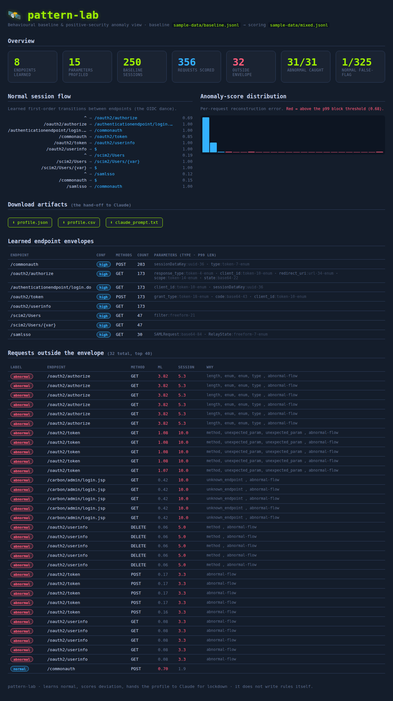

# pattern-lab — behavioural traffic baselining for positive-security WAF lockdown

**Watch a production app's real traffic, learn what *normal* looks like, and
lock the app down to that envelope — then let Claude turn the learned profile
into the actual ModSecurity rules.** The system itself writes no rules; it
*learns patterns and scores deviation*.

This is the **positive-security** (allow-list) model that commercial WAFs call
"learning mode." The OWASP CRS gives you negative security (block known
attacks); pattern-lab wraps a **per-app positive-security envelope** around it,
learned from real traffic — so anything outside the app's normal behaviour is
flagged **without any attack signature**.

The worked example is **WSO2 Identity Server 7.2** behind the CRS.



---

## Why positive security (and why ML-style)

A signature-based WAF asks *"does this look like a known attack?"* — it misses
novel abuse and false-positives on benign-but-weird app traffic. Positive
security inverts the question: *"is this inside the envelope of normal traffic
we observed for THIS app?"* An IdP's endpoints, parameters and login flow are
highly regular, so their "normal" is a tight region in feature space and
deviation is measurable.

The traffic is high-dimensional and structured (per-endpoint, per-parameter,
per-session), so we use **ML-style unsupervised modelling** rather than hand
rules — trained **only on normal traffic**, no attack labels:

| Model | Question it answers | Technique |
|---|---|---|
| **Envelope** (`anomaly.EnvelopeChecker`) | Is this request inside the learned per-endpoint/param envelope? | deterministic profile check (type, length p99, enum, charset, method) |
| **Request anomaly** (`anomaly.BaselineModel`) | How unlike normal is this request *as a whole*? | **PCA-reconstruction error** (the autoencoder idea, in numpy); block at the 99th percentile of normal. Optional real **autoencoder** tier (`AutoencoderModel`) when PyTorch is present — same `fit`/`score` API |
| **Session flow** (`sessions.SequenceModel`) | Is this client's *sequence* of endpoints a normal flow? | first-order **Markov** model of the OIDC dance; surprise + never-seen transitions |

> On "deep learning": a true autoencoder is wired in as an optional tier, but
> the **default is a numpy PCA-reconstruction model** — the same "learn the
> normal manifold, score by reconstruction error" idea, without a GPU or a
> training pipeline. It runs anywhere and every dimension is interpretable.
> That is a deliberate, honest engineering choice, not a shortcut. See
> [Where this can fail](#where-this-can-fail).

---

## The pipeline

```
 request log of NORMAL traffic (JSON lines)          request log to score
        │                                                    │
        ▼                                                    │
 ┌──────────────┐  learn per-endpoint/param ENVELOPES        │
 │  profile.py  │  + coverage/confidence                     │
 ├──────────────┤                                            │
 │  anomaly.py  │  fit PCA/autoencoder on normal features    │
 ├──────────────┤                                            ▼
 │ sessions.py  │  fit Markov flow model  ───────►  ┌──────────────┐
 └──────┬───────┘                                   │  evaluate()  │ score each request:
        │                                            │  envelope +  │  envelope / ML / flow
        ▼                                            │  ML + flow   │
 ┌──────────────┐  profile.json + profile.csv        └──────┬───────┘
 │  report.py   │  (the learned baseline)                   │
 └──────┬───────┘                                            ▼
        ▼                                            anomalies.csv (deviations)
 ┌────────────────────┐   profile.json ─────────►  Claude  ─────►  lockdown .conf
 │ claude_prompt.py   │   "turn this normal profile into a positive-security
 └────────────────────┘    lockdown on top of the CRS"   (WE don't write rules)
```

---

## Quick start (no Docker)

The engine needs only **numpy**. A realistic WSO2 request log ships in
`sample-data/` (`baseline.jsonl` = normal to learn from; `mixed.jsonl` = a fresh
day with a labelled abnormal holdout to score).

```bash
cd pattern-lab
pip install numpy
python analyze.py --baseline sample-data/baseline.jsonl \
                  --score    sample-data/mixed.jsonl --out out/
```

Terminal report + these artifacts in `out/`:

| file | what it is |
|---|---|
| `profile.json` | the learned behavioural baseline (endpoints, param envelopes, flow) — **the Claude hand-off** |
| `profile.csv` | flat per-(endpoint, parameter) envelope table |
| `anomalies.csv` | requests in `--score` that fell outside the envelope, with the reason |
| `claude_prompt.txt` | ready-to-paste prompt: *profile → positive-security lockdown* |

On the shipped sample the model learns 8 endpoints / 15 params from 250 normal
sessions and, scoring a fresh day, **catches 31/31 injected abnormal requests
with 1/325 normal false-flags** — all without a single attack signature. The
abnormals are deliberately *not* classic payloads: an over-long `redirect_uri`,
an unexpected `debug`/`cmd` param, a wrong method, a brand-new endpoint, and an
out-of-order login flow — the things signatures miss and behaviour catches.

### Optional autoencoder tier

```bash
pip install torch
python analyze.py --baseline sample-data/baseline.jsonl --score sample-data/mixed.jsonl --autoencoder
```

Falls back to the numpy PCA model automatically if torch isn't installed.

### The dashboard

```bash
pip install flask numpy
BASELINE=sample-data/baseline.jsonl SCORE=sample-data/mixed.jsonl python webapp/app.py
# → http://localhost:8050
```

KPI tiles, the learned **session-flow** transitions, the **anomaly-score
distribution** with its block threshold, the per-endpoint **envelopes**, and the
feed of requests **outside the envelope**. Inline SVG/CSS — no CDN, air-gapped.

### Hand the profile to Claude for the lockdown

```bash
export ANTHROPIC_API_KEY=sk-...
python analyze.py --baseline sample-data/baseline.jsonl --score sample-data/mixed.jsonl --claude
# → out/claude_lockdown.conf   (positive-security rules drafted from the profile)
```

No key? `analyze.py` writes `claude_prompt.txt` to paste into claude.ai. The
prompt tells Claude to enforce the learned envelope, allow-list methods, prefer
anomaly *scoring* over hard denies, and **never lock down a low-confidence
endpoint** — always on top of the CRS, never replacing it.

---

## Full test environment (Docker) — real WSO2 IS 7.2 behind the WAF

```bash
docker compose up -d                                                # IS 7.2 + CRS WAF + sample SPA (~2 min)
docker compose --profile gen run --rm -e MODE=baseline trafficgen   # learning window → capture/baseline.jsonl
docker compose --profile gen run --rm -e MODE=mixed    trafficgen   # a day to score → capture/mixed.jsonl
docker compose --profile dash up -d dashboard                       # http://localhost:8050
# or on the host:
python analyze.py --baseline capture/baseline.jsonl --score capture/mixed.jsonl --out out/
```

- `wso2is` — the real `wso2/wso2is:7.2.0` image.
- `waf` — `owasp/modsecurity-crs:nginx` in **DetectionOnly** during learning
  (observe, don't block), emitting a **JSON access log** of *every* request to
  the shared `./capture/` volume (`trafficgen/nginx-log-format.conf`).
- `trafficgen` — drives realistic user sessions through the WAF and records what
  it sent in the same schema (the authoritative offline record).
- `sampleapp` — a static stand-in for a WSO2 sample JS app (the `redirect_uri`
  origin).

---

## Where this can fail

The brief asked to "make it possible **or say why it failed**." Straight answer.

**Proven, runs anywhere (tested — `python tests/test_engine.py`, 9 passing):**
the parser, endpoint/grammar discovery, per-param envelope learning, the PCA
anomaly model, the Markov flow model, scoring, and the profile/CSV/prompt
export. On the sample it separates 31/31 abnormal from 325 normal with one
false-flag. The dashboard and all downloads are smoke-tested.

**Honest limitations, by design:**

1. **Baseline quality is everything.** Positive security learns "normal" from
   what you show it. If the learning window contains attacks or is too short,
   the envelope is wrong. Mitigations built in: **coverage/confidence** per
   endpoint/param (under-observed items are reported, never locked down), and
   learning under CRS **DetectionOnly** so gross attacks are filtered first. It
   still needs a human to bless the window before go-live.
2. **"Deep learning" is a tier, not the default.** A real autoencoder/RNN needs
   lots of data and training infra; forcing it would make the tool fragile and
   non-reproducible. The default numpy PCA model captures the same
   reconstruction-error signal, runs with zero GPU, and is fully interpretable.
   The autoencoder is there for when you have the data and want a non-linear
   manifold — it is not faked, it is optional.
3. **The client IP must be trustworthy.** The per-client and session signals are
   only as good as the IP you log. Behind a load balancer, log the real client
   IP (real-ip module / trusted `X-Forwarded-For`), or every request looks like
   it came from the LB and the flow model collapses. Flagged in the nginx
   snippet.
4. **WSO2 IS 7.2 is heavy.** ~2 GB RAM, 90–120 s to boot; on a small host the
   WAF can start before IS is healthy (the compose healthcheck gates this, but a
   RAM-starved IS can still crash-loop).
5. **Traffic ≠ completed logins.** `trafficgen` reproduces real request *shapes
   and flows*; it does not complete real OIDC logins (needs a registered SP +
   credentials). The capture — what matters for baselining — is unaffected.
6. **It scores, it does not decide.** Every anomaly is a signal with a stated
   reason; the lockdown `.conf` is drafted by Claude and is **a draft to review,
   never auto-applied**. Tune the thresholds to your risk appetite.

Net: the learn-normal / score-deviation / hand-to-Claude solution is **real and
works today** on any request log. The live-WSO2 loop is **reproducible but
resource-dependent** — the caveats above are environmental or deliberate, each
with a stated mitigation.

> WSO2 IS **7.3** works with the same pipeline unchanged; 7.2 per the brief.

---

## Layout

```
pattern-lab/
├── analyze.py                 # end-to-end CLI: learn baseline → score → export
├── engine/                    # the algorithm (numpy only for the core)
│   ├── parser.py              #   request log → Request objects
│   ├── features.py            #   endpoint templating + per-request feature vector
│   ├── profile.py             #   learn endpoint/param envelopes + confidence
│   ├── anomaly.py             #   PCA / autoencoder anomaly model + envelope check
│   ├── sessions.py            #   session reconstruction + Markov flow model
│   ├── report.py              #   profile → JSON / CSV
│   └── claude_prompt.py       #   profile → Claude lockdown prompt (+ optional API)
├── webapp/                    # Flask dashboard (inline-SVG charts)
├── trafficgen/                # realistic session generator + nginx JSON log format
├── wso2-sample-app/           # static stand-in SPA
├── sample-data/               # generator + committed baseline.jsonl / mixed.jsonl
├── tests/                     # 9 engine tests (python tests/test_engine.py)
└── docker-compose.yml         # WSO2 IS 7.2 + WAF (DetectionOnly) + SPA + gen + dash
```
