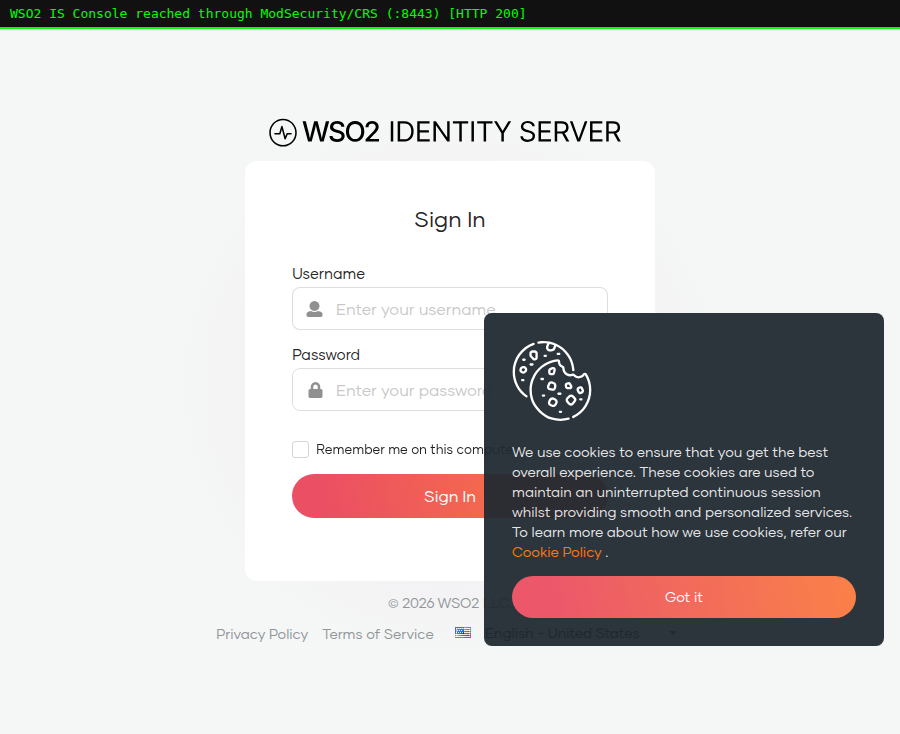
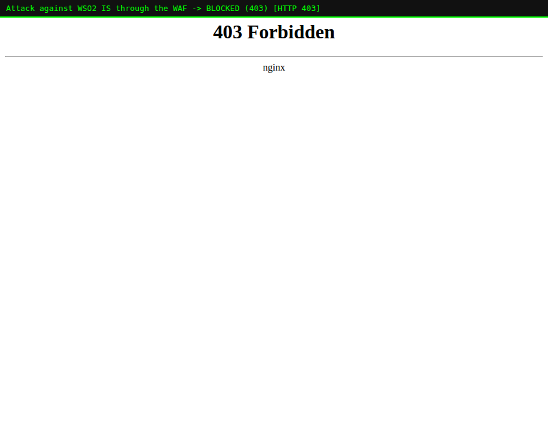
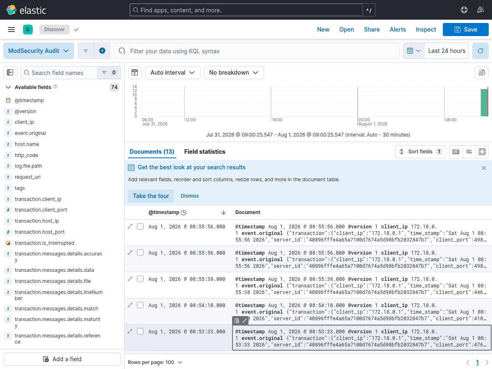

# WSO2 IS 7.3 + ModSecurity (OWASP CRS) + ELK

A single Docker image running **WSO2 Identity Server 7.3** behind
**nginx + ModSecurity + the OWASP Core Rule Set**, with both the WAF's audit
log and WSO2 IS's own logs/authentication events shipped into an **ELK
stack** (Elasticsearch, Logstash, Kibana) for traffic analysis.

This project is **independent** of the ModSecLabs course in the rest of this
repo — different branch, different stack, nothing shared.

```
  client --HTTPS:8443--> [ nginx + ModSecurity/CRS ] --127.0.0.1:9443--> [ WSO2 IS 7.3 ]
                                    |                                         |
                        ModSecurity JSON audit log                 audit.log / real-time
                            (shared volume)                        auth events (HTTP POST)
                                    |                                         |
                                    v                                         v
                              [ Logstash ] <---------- shared volumes -------+
                                    |
                                    v
                          [ Elasticsearch ] <---- [ Kibana :5601 ]
```

Only **:8080/:8443** (the WAF) are published to the host. WSO2 IS's own
`:9443` is intentionally **not** published — every request must go through
ModSecurity first.

---

## What's actually in the image

`Dockerfile` is a multi-stage build:

- **Base:** `owasp/modsecurity-crs:nginx` (Debian 13, nginx 1.30 + ModSecurity3
  + CRS).
- **Copied in:** the JDK 21 and full WSO2 IS 7.3.0 distribution, taken
  directly from the official `wso2/wso2is:7.3.0` image's filesystem — not
  re-downloaded, so it's byte-identical to the vendor's own binaries.
- **Supervised by `supervisord`:** nginx/ModSecurity and WSO2 IS run as two
  sibling processes in the one container, both logging to stdout so
  `docker logs wso2is-modsec` shows everything interleaved.

Every fact this Dockerfile relies on (image tag, JDK path, uid/gid, exposed
ports, config-override mechanism, log file paths, the authentication
event-publisher file and its default adapter) was **verified by inspecting
the real, running images** before being written — see the comments in the
Dockerfile for what was checked and why.

### Two real bugs found and worked around while building this

1. **`wso2server.sh start` backgrounds itself and exits 0 immediately** — fine
   for a normal host install, fatal for a supervised container process
   (supervisord thinks the program crashed). Fix: run `wso2server.sh` with
   **no arguments** (its default "RUN" mode execs the JVM in the
   foreground) — confirmed this is exactly what the official
   `wso2/wso2is:7.3.0` image's own entrypoint does by default.
2. **The base image's `proxy_backend_ssl.conf.template` references
   `${PROXY_SSL_CERT}` / `${PROXY_SSL_CERT_KEY}`, but the env vars it actually
   ships are `PROXY_SSL_CERT_FILE` / `PROXY_SSL_CERT_KEY_FILE`** — a genuine
   name mismatch in that image version. Setting `PROXY_SSL=on` (which includes
   that template) crashes nginx with `unknown "proxy_ssl_cert" variable`. Fix:
   don't set it — `PROXY_SSL` only controls presenting a *client* certificate
   for mutual TLS to the upstream, which WSO2 IS doesn't require, so leaving
   it at its default (`off`) is correct and a plain `proxy_pass https://...`
   to the self-signed backend works fine (`proxy_ssl_verify` is independently
   `off` by default already).

---

## Quick start

```bash
cd wso2is-modsec-elk
docker compose up -d --build
```

WSO2 IS takes **~30-40 seconds** to finish booting (it's a full Carbon/OSGi
server). Watch for the readiness line:

```bash
docker logs -f wso2is-modsec | grep "WSO2 Carbon started"
```

Then:

```bash
# Console, through the WAF (self-signed cert -> curl -k / browser "advanced -> proceed")
curl -ki https://localhost:8443/console

# Elasticsearch
curl http://localhost:9200/_cat/indices?v

# Kibana
open http://localhost:5601
```

### If Elasticsearch stays `red` with 0 active shards

Elasticsearch refuses to allocate shards once available disk drops below its
default watermarks (90% used = high watermark). On a small VM/CI sandbox this
trips almost immediately even with plenty of *absolute* free space, because
it's a percentage of the whole disk, not just this project's usage. Fix (fine
for a lab; use real disk headroom in production instead of raising these):

```bash
curl -X PUT localhost:9200/_cluster/settings -H 'Content-Type: application/json' -d '{
  "persistent": {
    "cluster.routing.allocation.disk.watermark.low": "95%",
    "cluster.routing.allocation.disk.watermark.high": "97%",
    "cluster.routing.allocation.disk.watermark.flood_stage": "98%"
  }
}'
```

---

## Proof it works (verified live before this was pushed)

**1. WSO2 IS Console reachable through the WAF** — the full React SPA loads,
proving the reverse proxy correctly relays the app's JS/CSS/API calls:



**2. An attack against the same endpoint is blocked**:

```bash
curl -ki "https://localhost:8443/console?x=<script>alert(1)</script>"
# HTTP/1.1 403 Forbidden
```



**3. The block is indexed into Elasticsearch and visible in Kibana Discover**
— 13 real documents, full ModSecurity transaction JSON, `client_ip`,
`request_uri`, `http_code` all parsed out as their own fields:



**4. WSO2 IS's own audit.log is flowing too** (36+ documents in
`wso2is-audit-*` from normal server activity during boot/testing).

---

## The three data sources feeding ELK

| Source | Mechanism | ES index |
|---|---|---|
| ModSecurity audit log | `Logstash` `file` input tailing a shared volume (`MODSEC_AUDIT_LOG_FORMAT=JSON`, one object per logged transaction) | `modsec-YYYY.MM.dd` |
| WSO2 IS `audit.log` | `Logstash` `file` input tailing a shared volume (`repository/logs/audit.log`) | `wso2is-audit-YYYY.MM.dd` |
| WSO2 IS authentication events | The **`IsAnalytics-Publisher-wso2event-AuthenticationData`** event publisher, switched from its default `logger` adapter to `http`, POSTing each login/auth attempt as JSON straight to Logstash's `http` input in real time | `wso2is-auth-YYYY.MM.dd` |

No Filebeat — for a single-host lab, Logstash's own `file` input tailing a
Docker volume shared with the `app` container is one less moving part and
does the same job.

### Seeing a real authentication event

The auth-event pipeline (source 3) is fully wired and independently verified
— the event publisher XML inside the image correctly targets
`http://logstash:8084` (confirmed by reading the file back out of the running
container), and Logstash's `http` input on `:8084` was confirmed to correctly
receive and index a JSON POST into `wso2is-auth-*`. What wasn't scripted here
is a **live browser login** — WSO2 IS 7.3's login flow is a JS-driven SPA
(`/authenticationendpoint`) that needs a `sessionDataKey` from a real
OAuth2/SAML authorization redirect, which isn't practical to fake with `curl`.
To see a real event: open `https://localhost:8443/console` in a browser, log
in with `admin` / `admin`, then check:

```bash
curl http://localhost:9200/wso2is-auth-*/_count
```

---

## Security notes (this is a lab configuration)

- `xpack.security.enabled=false` on Elasticsearch and no auth on Kibana — do
  **not** run this configuration on a network you don't control.
- WSO2 IS ships with default `admin`/`admin` super-admin credentials
  (`[super_admin]` in `deployment.toml`) — change this before using real data.
- ModSecurity is deployed at `PARANOIA=1`, `ANOMALY_INBOUND=5` (CRS
  defaults). See the ModSecLabs course (the `claude/modsecurity-lab-guides-omi063`
  branch / `main`) for a full treatment of tuning these for production.

---

## Files

```
wso2is-modsec-elk/
├── Dockerfile                          # WSO2 IS 7.3 + ModSecurity/CRS, one image
├── docker-compose.yml                  # app + elasticsearch + logstash + kibana
├── docker/
│   ├── start.sh                        # renders nginx templates, then supervisord
│   └── supervisord.conf                # runs nginx + wso2server.sh together
├── logstash/pipeline/
│   └── wso2is-modsec.conf              # the 3-source pipeline described above
└── screenshots/
```
